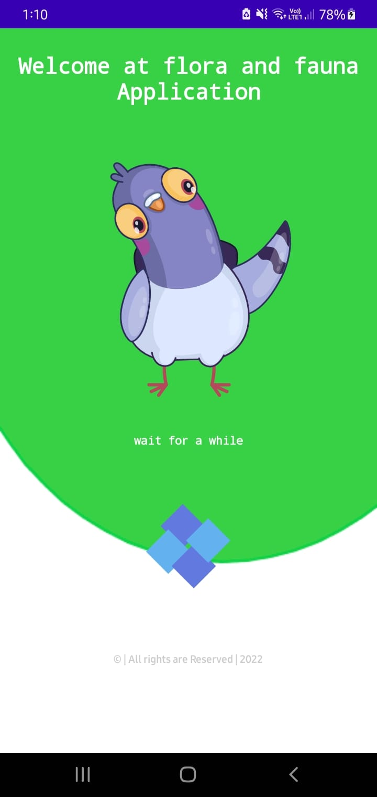
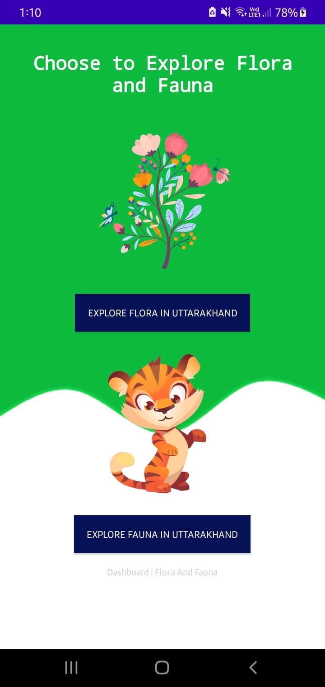
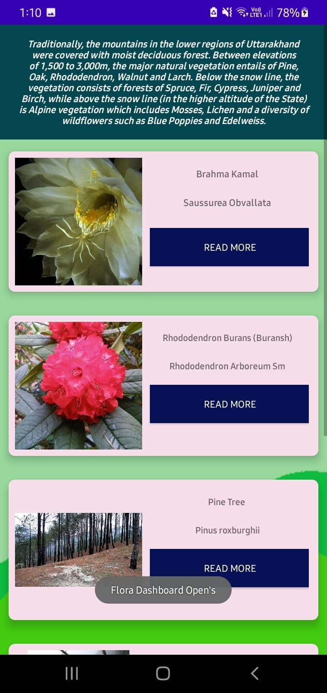
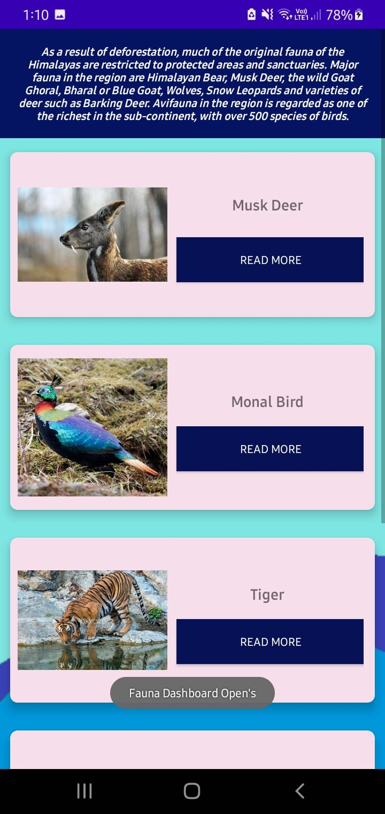
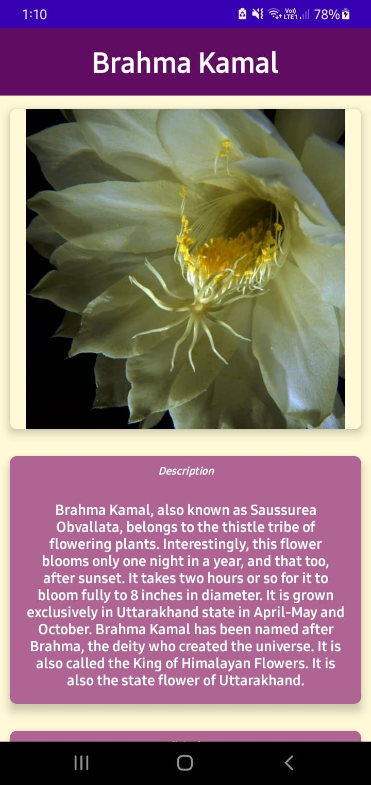
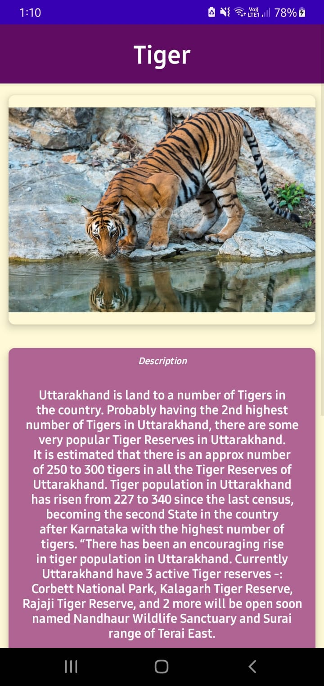
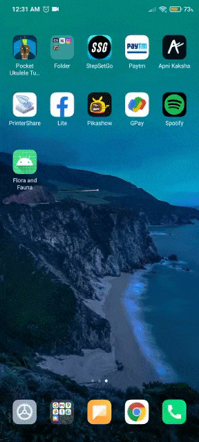

# Flora and Fauna Android Application

It is a static android application that shows flora and fauna present in Uttarakhand India.

The main purpose of this project is to build a mobile application that can be used and accessed by anyone. The technology working behind in such a way to give a look at Uttarakhand’s Biodiversity. There is a lot more to know about the Biodiversity of Uttarakhand India. Here we are providing some keys to it so that one can easily go through some of the diverse range of flora and fauna habitats in Uttarakhand India.

 

__Note: Please follow the below mentioned procedures to make this project run efficiently.__

 

&nbsp;
&nbsp;

---

## Technology Used

1. Front End
    * XML
    * Lottie Animations
2. Back End
    * Java
3. Platform Used
    * Android Studio

---

## Dependencies

* Install Android Studio as per your device/system.
* Download From Here &nbsp; [Android Studio](https://developer.android.com/studio "Download Android Studio From Here")

---

## How to use

* Download the project or clone it using git commands.
* Open the project from open option available inside Android Studio.
* Use Real time device or Virtual device to run the project.
* Press Run button inside Android Studio.
* And, observe the output in your respective device.

---

## Project Screenshots

 &nbsp;
 &nbsp;
 &nbsp;
 
 &nbsp;
 &nbsp;
 &nbsp;

---

# Project Demo

---

## Important Notes

* Please Don't delete any file
* If any error occur Please Google it! 😂😂
